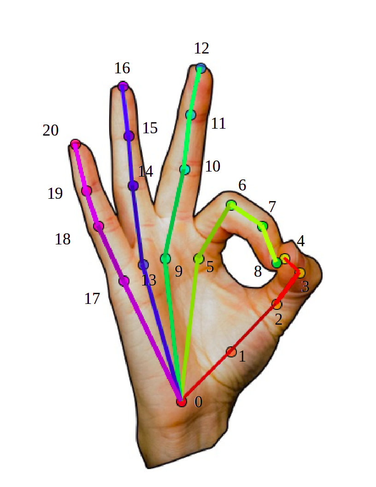

---
hide:
  - toc
---

# Welcome 

## Welcome to the [Hand Tracking Tool](https://dguari1.github.io/hand_tracking/))

{ align="left", width="150" }
The Hand Tracking Tool is an open-source software platform for tracking hand movements from videos using modern machine learning approaches. 

This code-free software employs deep learning models from [Google's MediaPipe](https://google.github.io/mediapipe/solutions/hands.html) with a custom interface to simplify hand tracking. 

The Hand Tracking Tool can be used as a general tool for tracking hand movement in videos. However, this tool was designed to assess upper limb **Bradykinesia** by tracking the distance between the index and thumb fingers during the *Finger Tapping Test*, a commonly used test that examines motor functioning in Parkinson's disease and other neurological diseases. 

## Data Privacy

Data privacy is at the heart of the Hand Tracking Tool, we are  committed to keep your data safe. For this reason, your data is processed locally in your computer. 

One important limitation of machine learning applications is the need to submit your data to an external server for processing. However, this is not feasible with sensitive clinical data such as patients videos, where the patient's face or other identifiable features might be visible.

The Hand Tracking Tool is an **offline** tool, this web application can be used without being connected to the internet after downloading the deep learning models for video processing. Data is processed locally on the user's computer, and never sent to an external server. 

We made this tool offline to make sure that everyone can use it regardless if the processed data is personal or clinical. However, this design decision implies that the time to process videos will vary widely from computer to computer. To speed up processing, it is recomended to use the Hand Tracking Tool with a computer that includes a GPU. 

