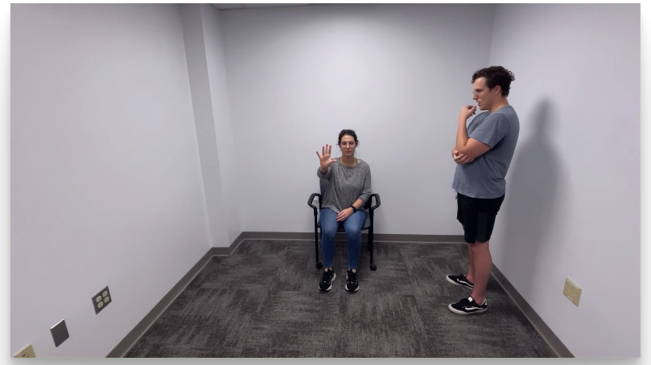
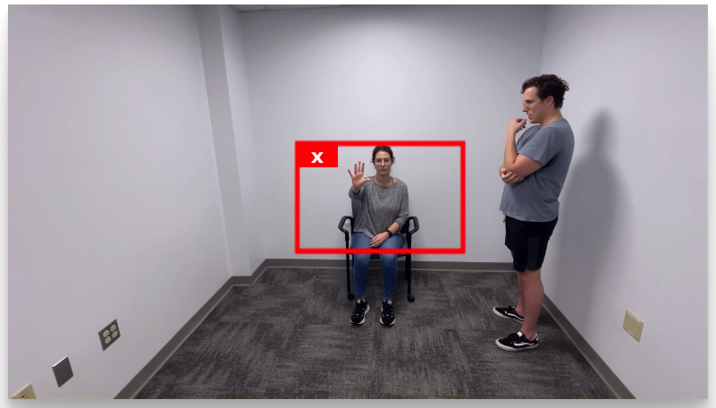
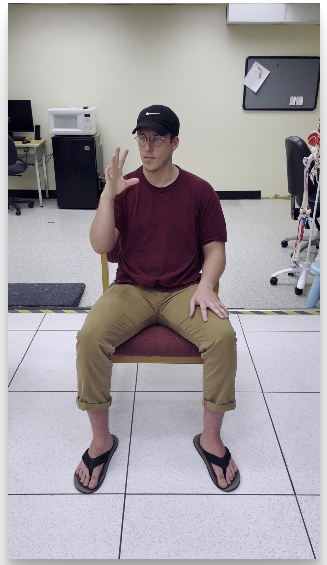
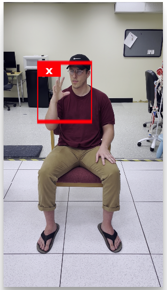
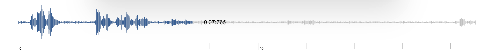
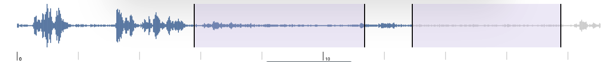

---
hide:
  - toc
---

# Processing Videos

Processing a video can be achieved following these steps: 

### 1. Load a valid video file:
   
:   Click **Load Video** and select a video file

### 2. Select the area of the video that contains the hand (s)

:   The algorithms used for video processing will try to automatically localize the hands in the video. However, if there is more than one person in the video, or if the video is not focused on the person of interest, the algorithms might have issues localizing the hands and produce erroneus results. 

    The Hand Tracking Tool allows you to select an area of the video where the algorithm can easily find the hands for processing. To select an area, simply click anywhere in the video and drag you mouse, a red rectangle will appear demarking the selected area. You can only select one area for the video.

    Next, we discuss a few scenarios demonstrating the use of the area selection tool:

    ##### a. More than one person in the frame:

    Often, the video frames contain the subject and the clinician performing the evaluation. In that case, the area selection tool can be used to select the region of the video containing the subjects' hands as shown in the following images

    { width="400" } { width="400" }
 

    ##### b. Select a single hand

    Sometimes, we would like to get results from a single hand. In that case, is possible to select the area of the video containing the hand of interest as shown in the following images

    {width="200" } {  width="200" }

    !!!note     
        You don't need to select an area for The Hand Tracking Tool to work. However, selecting an area might speed up the processing and improve the tracking accuracy.

### 3. Select the segment (s) of the video for analysis

:   When you upload a video, The Hand Tracking Tool will read the audio from the video file and display an audio waveform under the video. This audio waveform can be used to quckly navigate through the video by clicking at different time points. The cursor in the audio waveform indicates the current video timestamp. 

{ width="1000" }

You can click and drag in any portion of the audio waveform to select a segment in the video for processing. You can only select up to two segments per video, corresponding to the Finger Taping Test for the left and righ hands. 

The following image demonstrates the selection of two segments in the video, each segments corresponds to activity in each hand 

{ width="1000" }

You can adjust the segments using your mouse by draging the borders to the left or right. You can also remove a segment by double click on it.

!!!note     
        You don't need to select a video segment for The Hand Tracking Tool to work. However, selecting a video segment will improve the processing speed and gurantee that the algorithm is used to track the desired movement. 

### 4. Process the video

:   Click on **Process** and wait until the algorithm processes all the video frames. The processing can be cancelled at any time; however, if the process is cancelled, the information will be lost. 

## Model Selection 

By default, the Hand Tracking Tool will attemp to localize and track only the hands from the video. However, in cases where there is a lot of movement, the algorithm might have difficulties tracking the hands. To address this limitation, The Hand Tracking Tool can do an initial hand localization step before tracking the hand movement. For this, you must select the *Full Body* option at the bottom of the screen. 

Note that selecting the *Full Body* option will significantly increase the processing time. This option should be used as last resource.