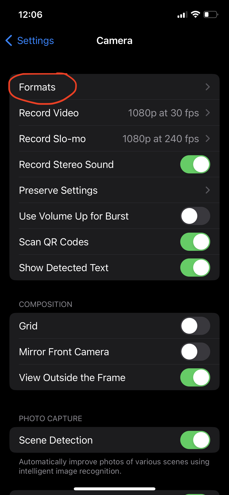
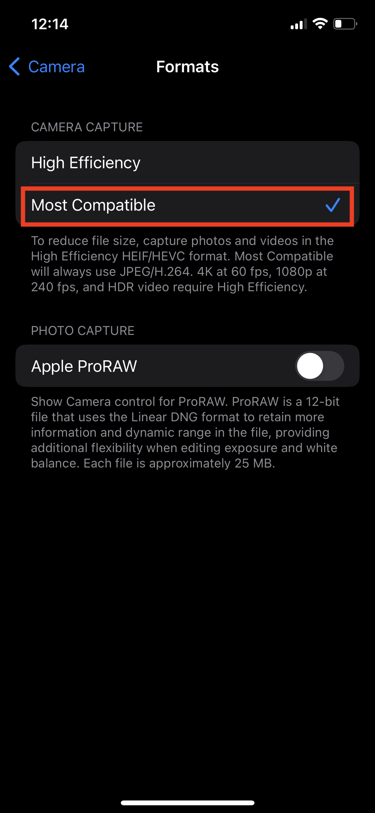

---
hide:
  - toc
---
#Recordings 

You can use your preferred device to record videos. The web app also provides a handy tool to record videos using your webcam. The videos are recorded as ``.webm`` and encodec using the ``h.264`` codec. 

## Webcam 

The recording tool can be found under the **>>Record** section of the application. This recording tool will allow you to record short videos (maximum 30s) and will stop automatically. You can also stop the recording at any point. Once the recording is completed, a save window will appear where you can selecte the file name and path. Video files will be recorded with extension `.webm`.

## iPhone

If you are recording with an iPhone, you must adjust the format that the camera uses to store videos. In *Settings*, go to *Camera* and select *Formats* 

{ align="center", width="250" }

and then select *Most Compatible* 

{ align="center", width="250" }

You migh also chose to record your videos at 60 fps to improve the quality of movement tracking results. 
