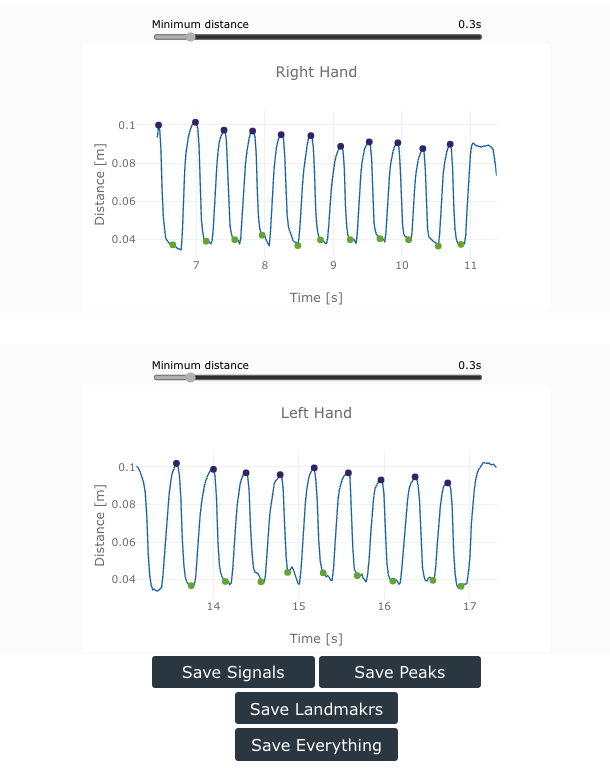

---
hide:
  - toc
---

# Results 

Once you start processing a video, the progress will be shown in the audio waveform. This visual aid will help you to estimate the processing speed and remaining processing time. 

After the video processing in completed, The Hand Tracking Tool will provide two plots showing the distance between thumb and index fingers for the right and left hands. If you analysis includes only one hand, then you will still see both plots but only one will have data. You can download the plots as images by right click on the plot. 

{ width="500" }

The signals were low-pass filtered by a 10Hz filter before displaying them. 

### Peaks and valleys

The Hand Tracking Tool will automatically identify the peaks and valleys on the signal, corresponding to the opening and closing of the fingers. Peaks are identified with a purple marks, and valleys with a green mark. 

#### Modifying Peaks and Valleys

 - __Peak to Peak Distance__: The peak detection algorithm can be modified to discard peaks that are too close toghether. The default minimum distance is 0.3s, and this value can be modified with the sliding bar on top of the plot. 

- __Remove Peaks or Valleys__: You can select a peak or valey by clicking on it, the selected element will change its color to magenta
    - To de-select an element, press ++escape++
    - To remove an element, press ++back++

- __Add Peaks__: You can add a new Peaks by pressing and holding ++q++, and clicking in the curve. A new purple mark will be added.

- __Add Valley__: You can add a new Valley by pressing and holding ++a++, and clicking in the curve. A new green mark will be added.

### Saving Data

The Hand Tracking Tool allows you save all the resuls, including the signals, the peaks and valleys, the landmarks, and everything together. Data will be stored as a .JSON file than can be easily read using regular data analysis software. 

