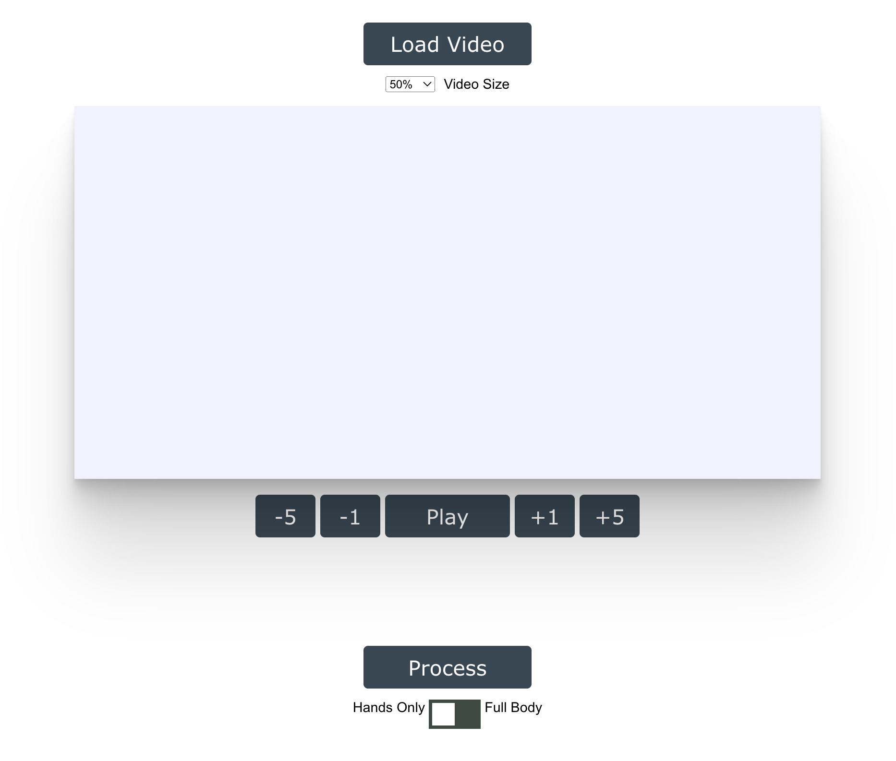

---
hide:
  - toc
---

#Getting Started

Notice that you need a working internet connection to use the app. 

The video analysis app can be found under the **>>Video Analysis** section of the application. Once you load the web app, you will see a **Load Video** button that is disabled (you cannot click on it). The button will become enable once the hand tracking model is downloaded from the server. 

At this point, the user can disconnect the computer from the internet and continue ussing the application offline. The videos will be processed locally. 

## Components 
{ align="center", width="750" }

The Hand Tracking Tool has 7 main components: 

### Load Video button

When clicked, the user is promted to select a video from the computer hard drive. If the video is too large (more that a few minutes), it is recorded to create a short version of the video in any video editing software. 

### Video size selector

A handy tool that allows you to change the size of the video in the screen. Default value is 50%.

### Video display

Video visualization 

### PlayBack controls 

Buttons to manipulate the video playback. Users can Play/Pause a video, and move forward and backward in the video jumping 1 frame or 5 frames at the time. 

### Audio waveform signal visualizer 

Audio waveform visualizer

### Process button

Buttons to trigger/stop video analysis. The video processing algorithsm will begin inmmediatly after clicking on **Process**. These algorithms can be stopped at any moment by clicking on the same button. Note that if the process is stopped, then all the results obtained so far will be lost. 

Because of the way that most modern web browser handle background process, the video will be processed only if the tab containing the Hand Tracking Tool is visible (i.e., is not in the background). Thus, it is recomended not no open any other tabs in the same window than the Hand Tracking Tool. 

### Model selector 

The Hand Tracking Tool can use two models, a hand pose tracking mdoel and and a body pose tracking model. The tool uses the hand pose tracking model by default and should be the preferred option. However, under certain circumstances, the body pose tracking model might provide better results. 

Note that using the body pose tracking model will results in significant decrease in the processing speed. 